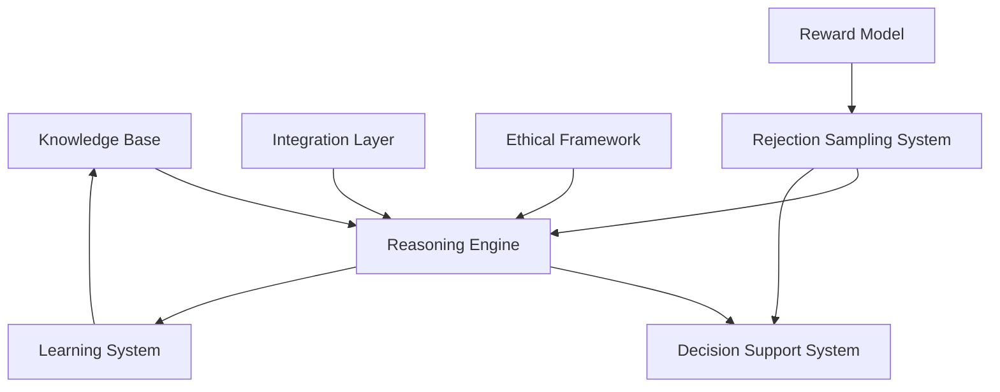
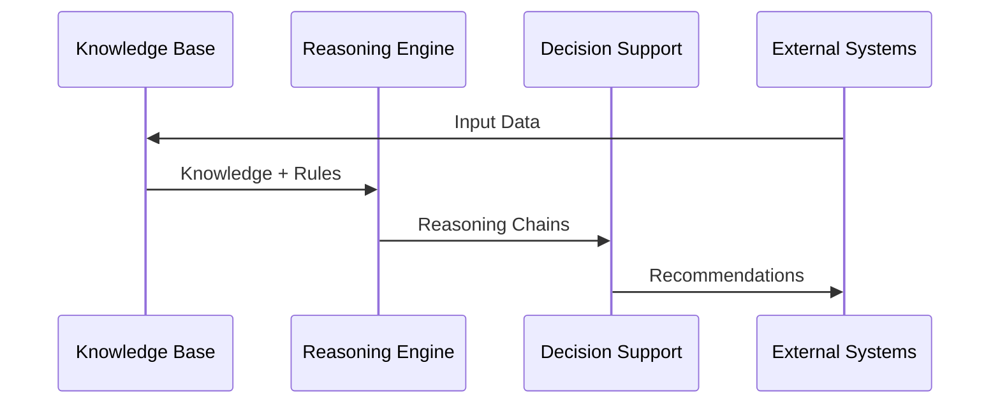

# AI Reasoning Framework - Core Architecture

## 1. System Overview

### 1.1 Purpose
The AI Reasoning Framework provides a systematic approach for AI agents to:
- Construct logical reasoning chains
- Make evidence-based decisions
- Generate and validate solutions
- Learn from experience
- Ensure ethical compliance

### 1.2 Core Components

## 2. Component Specifications

### 2.1 Knowledge Base
- **Triple Store**
  - Subject-Predicate-Object structure
  - Confidence scoring
  - Temporal validity
  - Source attribution
  - Context mapping

- **Fact Database**
  - Validated facts
  - Evidence links
  - Confidence levels
  - Update history
  - Cross-references

- **Rule Repository**
  - Inference rules
  - Domain rules
  - Validation rules
  - Priority rules
  - Meta-rules

### 2.2 Reasoning Engine
- **Logical Processing**
  - Deductive reasoning
  - Inductive reasoning
  - Abductive reasoning
  - Analogical reasoning
  - Causal reasoning

- **Pattern Recognition**
  - Solution patterns
  - Problem patterns
  - Context patterns
  - Error patterns
  - Success patterns

- **Rejection Sampling**
  - Multiple solution generation
  - Quality evaluation
  - Solution filtering
  - Reward modeling
  - Feedback integration

### 2.3 Decision Support System
- **Analysis Framework**
  - Option generation
  - Impact analysis
  - Risk assessment
  - Cost-benefit analysis
  - Trade-off evaluation

- **Recommendation Engine**
  - Solution ranking
  - Confidence scoring
  - Alternative generation
  - Implementation planning
  - Validation checks

- **Sampling Integration**
  - Candidate evaluation
  - Quality filtering
  - Reward calculation
  - Selection optimization
  - Performance tracking

## 3. Integration Architecture

### 3.1 External Systems
- Code Analysis Tools
- Version Control Systems
- Development Environments
- Testing Frameworks
- Deployment Systems

### 3.2 Data Flow

## 4. Quality Attributes

### 4.1 Performance Requirements
- Response Time: < 100ms for simple queries
- Throughput: > 1000 reasoning operations/second
- Concurrency: Support for multiple parallel reasoning chains
- Resource Usage: Efficient memory and CPU utilization
- Scalability: Horizontal scaling capability

### 4.2 Reliability Requirements
- Availability: 99.9%
- Data Consistency: Strong consistency for critical operations
- Error Recovery: Automatic recovery from non-critical failures
- Data Durability: No loss of validated knowledge
- Backup: Regular knowledge base snapshots

### 4.3 Security Requirements
- Access Control: Role-based access control
- Data Protection: Encryption at rest and in transit
- Audit Trail: Complete logging of reasoning operations
- Validation: Input and output validation
- Compliance: Regulatory and ethical compliance

### 4.4 Sampling Requirements
- Generation Count: 10-30 candidates per decision
- Response Time: < 100ms for candidate generation
- Evaluation Time: < 50ms per candidate
- Selection Time: < 50ms for final selection
- Resource Usage: < 80% of allocated resources

## 5. Implementation Guidelines

### 5.1 Development Standards
- Clean Architecture principles
- SOLID design principles
- Test-Driven Development
- Continuous Integration/Deployment
- Comprehensive Documentation

### 5.2 Technology Stack
- Programming Languages: TypeScript/Python
- Database: Graph Database for knowledge base
- Message Queue: For asynchronous processing
- Cache: For performance optimization
- API: REST and GraphQL interfaces

### 5.3 Sampling Integration
- **Generation System**
  - Candidate generation service
  - Parameter management
  - Resource allocation
  - Performance monitoring
  - Error handling

- **Evaluation System**
  - Reward model service
  - Quality assessment
  - Alignment verification
  - Performance tracking
  - Feedback collection

## 6. Future Extensions

### 6.1 Planned Capabilities
- Advanced natural language processing
- Multi-agent collaboration
- Automated learning from experience
- Real-time adaptation
- Enhanced visualization

### 6.2 Integration Points
- IDE plugins
- CI/CD pipeline integration
- Code review systems
- Documentation systems
- Monitoring systems 