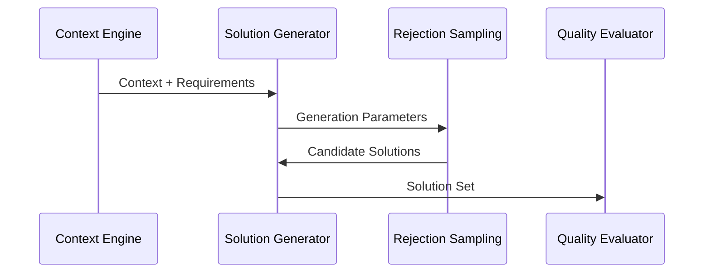
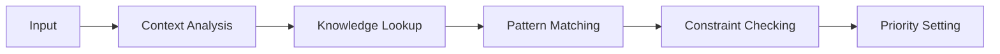
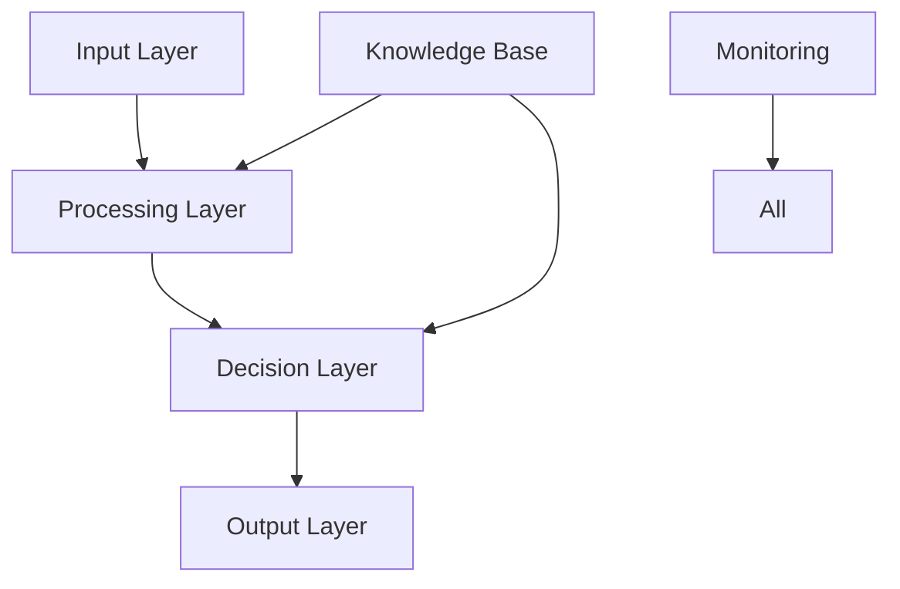

# Decision Support System

## 1. Overview

### 1.1 Purpose

The Decision Support System (DSS) integrates multiple framework components to:

- Generate optimal solutions
- Validate decisions
- Ensure quality
- Maintain consistency
- Support reasoning

### 1.2 System Architecture

graph TD
    A[Input Analysis] --> B[Context Engine]
    B --> C[Solution Generator]
    C --> D[Quality Evaluator]
    D --> E[Decision Validator]
    E --> F[Output Formatter]
    G[Knowledge Base] --> B
    G --> C
    H[Reward Model] --> D
    I[Rejection Sampling] --> C
    J[Ethical Framework] --> E
```

## 2. Core Components

### 2.1 Context Engine
- **Input Processing**
  - Request analysis
  - Context extraction
  - Requirement parsing
  - Constraint identification
  - Priority assessment

- **Knowledge Integration**
  - Domain knowledge
  - Historical data
  - Best practices
  - Pattern matching
  - Rule application

### 2.2 Solution Generator


### 2.3 Quality Evaluator

- **Evaluation Criteria**
  - Solution quality
  - Implementation feasibility
  - Resource efficiency
  - Maintainability
  - Scalability

- **Quality Metrics**
  - Code quality score
  - Performance metrics
  - Resource usage
  - Complexity measures
  - Maintainability index

## 3. Decision Process

### 3.1 Analysis Phase



### 3.2 Generation Phase
- **Solution Space**
  - Pattern-based solutions
  - Novel solutions
  - Hybrid approaches
  - Alternative paths
  - Optimization options

- **Quality Control**
  - Pre-validation
  - Constraint checking
  - Resource estimation
  - Impact analysis
  - Risk assessment

## 4. Integration Framework

### 4.1 Component Integration

- **Internal Systems**
  - Knowledge Base
  - Reasoning Engine
  - Reward Model
  - Rejection Sampling
  - Ethical Framework

- **External Systems**
  - Code Analysis
  - Version Control
  - Testing Framework
  - Deployment System
  - Monitoring System

### 4.2 Data Flow



## 5. Quality Assurance

### 5.1 Validation Process

- **Solution Validation**
  - Correctness checking
  - Completeness verification
  - Consistency validation
  - Performance testing
  - Security validation

- **Impact Analysis**
  - System impact
  - Resource impact
  - Performance impact
  - Maintenance impact
  - Cost impact

### 5.2 Quality Metrics

- **Solution Quality**
  - Correctness score
  - Completeness score
  - Consistency score
  - Performance score
  - Security score

- **Process Quality**
  - Response time
  - Resource usage
  - Error rate
  - Success rate
  - User satisfaction

## 6. Implementation Guidelines

### 6.1 Development Standards

- **Code Standards**
  - Clean code principles
  - SOLID principles
  - Design patterns
  - Error handling
  - Documentation

- **Testing Requirements**
  - Unit testing
  - Integration testing
  - Performance testing
  - Security testing
  - Acceptance testing

### 6.2 Deployment Process

- **Deployment Steps**
  - Environment setup
  - Dependency management
  - Configuration
  - Validation
  - Monitoring

- **Maintenance**
  - Regular updates
  - Performance tuning
  - Security patches
  - Bug fixes
  - Feature updates

## 7. Example Scenarios

### 7.1 Code Generation

```typescript
// Example decision support flow for code generation
interface DecisionContext {
  requirement: string;
  constraints: Constraint[];
  priorities: Priority[];
  resources: Resource[];
}

interface Solution {
  code: string;
  quality: QualityMetrics;
  impact: ImpactAnalysis;
  resources: ResourceUsage;
}

class DecisionSupport {
  async generateSolution(context: DecisionContext): Promise<Solution> {
    // 1. Analyze context
    const analysis = await this.contextEngine.analyze(context);
    
    // 2. Generate candidates
    const candidates = await this.solutionGenerator.generate(analysis);
    
    // 3. Evaluate quality
    const evaluatedSolutions = await this.qualityEvaluator.evaluate(candidates);
    
    // 4. Select best solution
    const bestSolution = await this.decisionValidator.validate(evaluatedSolutions);
    
    // 5. Format and return
    return this.outputFormatter.format(bestSolution);
  }
}
```

### 7.2 Problem Solving

```typescript
// Example decision support flow for problem solving
interface Problem {
  description: string;
  context: Context;
  constraints: Constraint[];
  criteria: Criteria[];
}

interface Solution {
  steps: SolutionStep[];
  rationale: string;
  impact: ImpactAnalysis;
  risks: Risk[];
}

class ProblemSolver {
  async solveProblem(problem: Problem): Promise<Solution> {
    // 1. Analyze problem
    const analysis = await this.contextEngine.analyzeProblem(problem);
    
    // 2. Generate solution candidates
    const candidates = await this.solutionGenerator.generateCandidates(analysis);
    
    // 3. Evaluate solutions
    const evaluatedSolutions = await this.qualityEvaluator.evaluateSolutions(candidates);
    
    // 4. Select best solution
    const bestSolution = await this.decisionValidator.validateSolution(evaluatedSolutions);
    
    // 5. Format and return
    return this.outputFormatter.formatSolution(bestSolution);
  }
}
```

## 8. Success Criteria

### 8.1 Performance Goals

- **Response Time**
  - Simple decisions < 100ms
  - Complex decisions < 1s
  - Batch processing < 5s
  - Analysis time < 2s
  - Validation time < 500ms

- **Quality Goals**
  - Decision accuracy > 95%
  - Solution quality > 90%
  - Resource efficiency > 85%
  - User satisfaction > 90%
  - Error rate < 1%

### 8.2 Operational Goals

- **System Health**
  - Availability > 99.9%
  - Response success > 99%
  - Data consistency 100%
  - Recovery time < 1s
  - Error handling 100%

- **Process Quality**
  - Process compliance 100%
  - Documentation complete
  - Testing coverage > 95%
  - Security compliance 100%
  - Monitoring coverage 100% 