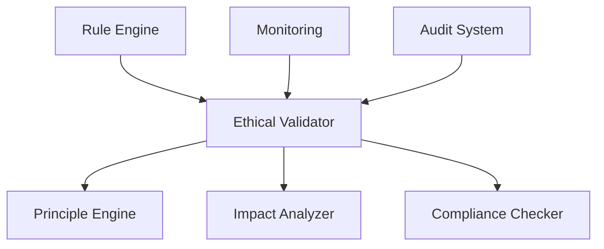

# Ethical Framework Specification

## 1. Overview

### 1.1 Purpose
The Ethical Framework ensures AI decisions adhere to:
- Ethical principles
- Compliance requirements
- Safety standards
- Fairness criteria
- Transparency requirements

### 1.2 Architecture


## 2. Core Components

### 2.1 Principle Engine
```typescript
interface EthicalPrinciple {
  id: string;
  name: string;
  description: string;
  rules: ValidationRule[];
  priority: number;
  context: string[];
  validation: (decision: Decision) => Promise<ValidationResult>;
}

class PrincipleEngine {
  private principles: Map<string, EthicalPrinciple>;
  private validator: Validator;

  async validateDecision(decision: Decision): Promise<ValidationResult> {
    // Get applicable principles
    const principles = this.getApplicablePrinciples(decision.context);
    
    // Validate against each principle
    const results = await Promise.all(
      principles.map(principle => 
        principle.validation(decision)
      )
    );
    
    // Aggregate results
    return this.aggregateResults(results);
  }

  private getApplicablePrinciples(context: string[]): EthicalPrinciple[] {
    return Array.from(this.principles.values())
      .filter(principle => 
        principle.context.some(ctx => context.includes(ctx))
      )
      .sort((a, b) => b.priority - a.priority);
  }
}
```

### 2.2 Impact Analyzer
```typescript
interface ImpactAnalysis {
  directImpact: Impact[];
  indirectImpact: Impact[];
  risks: Risk[];
  mitigations: Mitigation[];
  recommendation: Recommendation;
}

class ImpactAnalyzer {
  async analyzeDecision(decision: Decision): Promise<ImpactAnalysis> {
    // Analyze direct impact
    const directImpact = await this.analyzeDirect(decision);
    
    // Analyze indirect impact
    const indirectImpact = await this.analyzeIndirect(decision);
    
    // Identify risks
    const risks = await this.identifyRisks(decision, directImpact, indirectImpact);
    
    // Generate mitigations
    const mitigations = await this.generateMitigations(risks);
    
    // Create recommendation
    const recommendation = this.createRecommendation({
      decision,
      directImpact,
      indirectImpact,
      risks,
      mitigations
    });
    
    return {
      directImpact,
      indirectImpact,
      risks,
      mitigations,
      recommendation
    };
  }
}
```

## 3. Implementation Example: MCP Server Integration

### 3.1 Ethical Validation Service
```typescript
// src/services/ethical/MCPEthicalService.ts
export class MCPEthicalService {
  private principleEngine: PrincipleEngine;
  private impactAnalyzer: ImpactAnalyzer;
  private metrics: EthicalMetrics;

  constructor() {
    this.principleEngine = new PrincipleEngine();
    this.impactAnalyzer = new ImpactAnalyzer();
    this.metrics = new EthicalMetrics();
  }

  async validateLLMResponse(
    request: LLMRequest,
    response: LLMResponse
  ): Promise<ValidationResult> {
    // Create decision context
    const decision = this.createDecision(request, response);
    
    // Validate principles
    const principleValidation = await this.principleEngine
      .validateDecision(decision);
    
    // Analyze impact
    const impactAnalysis = await this.impactAnalyzer
      .analyzeDecision(decision);
    
    // Record metrics
    this.metrics.recordValidation({
      decision,
      principleValidation,
      impactAnalysis
    });
    
    // Return combined result
    return this.createValidationResult({
      principleValidation,
      impactAnalysis
    });
  }

  private createDecision(
    request: LLMRequest,
    response: LLMResponse
  ): Decision {
    return {
      context: this.extractContext(request),
      input: request.input,
      output: response.output,
      metadata: {
        timestamp: new Date(),
        model: response.model,
        confidence: response.confidence
      }
    };
  }
}
```

### 3.2 Real-time Monitoring
```typescript
// src/services/monitoring/EthicalMonitor.ts
export class EthicalMonitor {
  private metrics: PrometheusMetrics;
  private alerts: AlertManager;

  constructor() {
    this.metrics = new PrometheusMetrics({
      prefix: 'ethical_framework_'
    });
    this.alerts = new AlertManager();
  }

  async monitorDecision(decision: Decision): Promise<void> {
    // Monitor principle compliance
    const compliance = await this.checkCompliance(decision);
    this.metrics.gauge('principle_compliance').set(compliance.score);

    // Monitor impact
    const impact = await this.measureImpact(decision);
    this.metrics.gauge('impact_score').set(impact.score);

    // Check thresholds
    if (compliance.score < 0.95) {
      await this.alerts.raise({
        level: 'warning',
        message: 'Low principle compliance',
        decision,
        compliance
      });
    }

    if (impact.score > 0.8) {
      await this.alerts.raise({
        level: 'critical',
        message: 'High impact detected',
        decision,
        impact
      });
    }
  }
}
```

## 4. Quality Requirements

### 4.1 Performance Metrics
- **Validation Performance**
  - Principle validation: < 50ms
  - Impact analysis: < 100ms
  - Compliance check: < 30ms
  - Total validation: < 200ms
  - Batch processing: < 1s/100 decisions

- **Monitoring Performance**
  - Real-time checks: < 10ms
  - Alert generation: < 50ms
  - Metric recording: < 5ms
  - Report generation: < 1s
  - Audit log: < 10ms

### 4.2 Quality Metrics
- **Validation Quality**
  - Principle coverage: 100%
  - Impact accuracy: > 95%
  - Risk detection: > 99%
  - False positive: < 1%
  - False negative: < 0.1%

- **System Quality**
  - Availability: > 99.99%
  - Accuracy: > 99.9%
  - Consistency: 100%
  - Audit coverage: 100%
  - Response time: < 200ms

## 5. Monitoring Integration

### 5.1 Metrics Collection
```typescript
// src/monitoring/EthicalMetrics.ts
export class EthicalMetrics {
  private metrics: PrometheusMetrics;

  constructor() {
    this.metrics = new PrometheusMetrics({
      prefix: 'ethical_'
    });

    this.initializeMetrics();
  }

  private initializeMetrics(): void {
    // Validation metrics
    this.metrics.createHistogram({
      name: 'validation_duration_ms',
      help: 'Validation execution time in milliseconds',
      buckets: [10, 50, 100, 200, 500]
    });

    // Quality metrics
    this.metrics.createGauge({
      name: 'principle_compliance',
      help: 'Principle compliance score'
    });

    // Impact metrics
    this.metrics.createGauge({
      name: 'impact_score',
      help: 'Decision impact score'
    });
  }

  recordValidation(validation: ValidationResult): void {
    this.metrics.histogram('validation_duration_ms')
      .observe(validation.duration);
    this.metrics.gauge('principle_compliance')
      .set(validation.complianceScore);
    this.metrics.gauge('impact_score')
      .set(validation.impactScore);
  }
}
```

## 6. Success Criteria

### 6.1 Performance Goals
- Validation time within SLA
- Real-time monitoring active
- Resource usage optimized
- Alert latency minimal
- Audit trail complete

### 6.2 Quality Goals
- All principles enforced
- Impact fully analyzed
- Risks identified
- Compliance verified
- Transparency maintained 