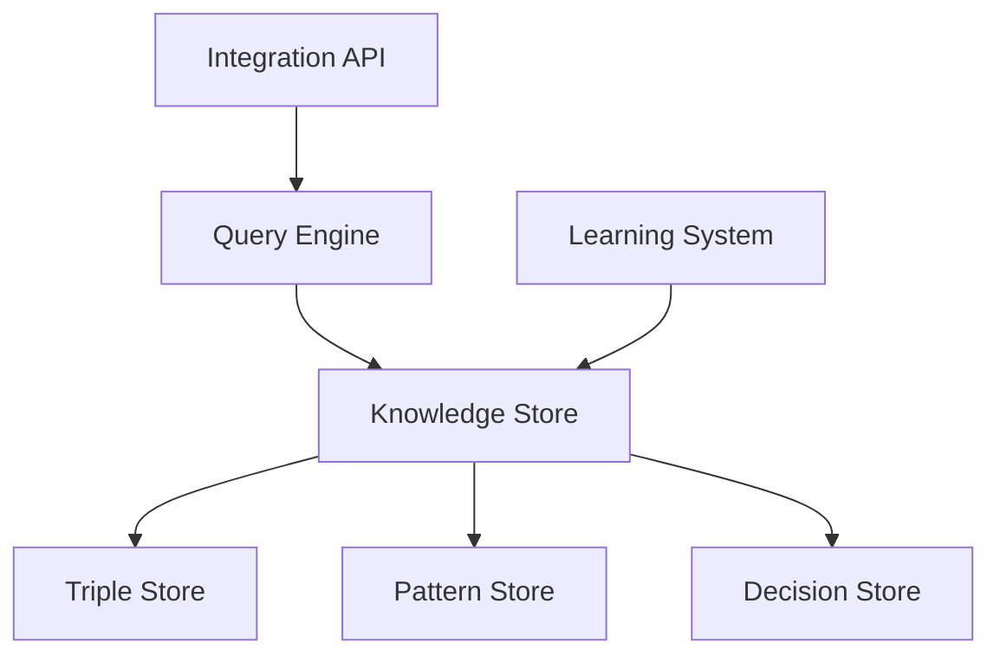

# Knowledge Base Specification

## 1. Overview

### 1.1 Purpose
The Knowledge Base provides structured storage and retrieval of:
- Domain knowledge
- Reasoning patterns
- Historical decisions
- Quality metrics
- Learning outcomes

### 1.2 Architecture


## 2. Core Components

### 2.1 Triple Store
```typescript
interface Triple {
  subject: string;
  predicate: string;
  object: string;
  confidence: number;
  timestamp: Date;
  metadata: {
    source: string;
    context: string;
    validation: ValidationResult;
  };
}

class TripleStore {
  async addTriple(triple: Triple): Promise<void> {
    // Validate triple
    const isValid = await this.validateTriple(triple);
    if (!isValid) throw new Error('Invalid triple');

    // Add to store with indexing
    await this.store.add({
      ...triple,
      indexes: this.generateIndexes(triple)
    });
  }

  async queryTriples(pattern: TriplePattern): Promise<Triple[]> {
    // Pattern matching with inference
    const matches = await this.store.query(pattern);
    const inferred = await this.inferenceEngine.expand(matches);
    return this.rankResults(inferred);
  }
}
```

### 2.2 Pattern Store
```typescript
interface Pattern {
  type: PatternType;
  structure: PatternStructure;
  context: string[];
  confidence: number;
  usage: {
    count: number;
    success_rate: number;
    last_used: Date;
  };
}

class PatternStore {
  async addPattern(pattern: Pattern): Promise<void> {
    // Validate and normalize pattern
    const normalized = await this.normalizePattern(pattern);
    
    // Add with metadata
    await this.store.add({
      ...normalized,
      metadata: this.generateMetadata(normalized)
    });
  }

  async findPatterns(context: string[]): Promise<Pattern[]> {
    // Context-aware pattern matching
    const matches = await this.store.find({
      context: { $contains: context }
    });
    return this.rankPatterns(matches);
  }
}
```

## 3. Implementation Example: MCP Server Integration

### 3.1 MCP Knowledge Service
```typescript
// src/services/knowledge/MCPKnowledgeService.ts
export class MCPKnowledgeService {
  private tripleStore: TripleStore;
  private patternStore: PatternStore;
  private cache: Cache;

  constructor() {
    this.tripleStore = new TripleStore();
    this.patternStore = new PatternStore();
    this.cache = new Cache();
  }

  async processLLMRequest(request: LLMRequest): Promise<KnowledgeResponse> {
    // 1. Extract context and requirements
    const context = this.extractContext(request);
    
    // 2. Find relevant patterns
    const patterns = await this.patternStore.findPatterns(context);
    
    // 3. Query knowledge base
    const knowledge = await this.tripleStore.queryTriples({
      context,
      patterns
    });
    
    // 4. Apply reasoning patterns
    const enrichedKnowledge = await this.enrichKnowledge(knowledge, patterns);
    
    // 5. Format response
    return this.formatResponse(enrichedKnowledge);
  }

  private async enrichKnowledge(
    knowledge: Triple[],
    patterns: Pattern[]
  ): Promise<EnrichedKnowledge> {
    // Apply reasoning patterns to expand knowledge
    const expanded = await Promise.all(
      patterns.map(pattern => 
        this.applyPattern(knowledge, pattern)
      )
    );

    // Merge and deduplicate results
    return this.mergeResults(expanded);
  }
}
```

### 3.2 Performance Optimization
```typescript
// src/services/optimization/KnowledgeOptimizer.ts
export class KnowledgeOptimizer {
  private cache: LRUCache<string, QueryResult>;
  private metrics: MetricsCollector;

  constructor() {
    this.cache = new LRUCache({
      max: 1000,
      maxAge: 1000 * 60 * 5 // 5 minutes
    });
    this.metrics = new MetricsCollector();
  }

  async optimizeQuery(query: Query): Promise<QueryResult> {
    // 1. Check cache
    const cacheKey = this.generateCacheKey(query);
    const cached = this.cache.get(cacheKey);
    if (cached) return cached;

    // 2. Optimize query plan
    const plan = await this.generateQueryPlan(query);
    
    // 3. Execute with monitoring
    const startTime = process.hrtime();
    const result = await this.executeQuery(plan);
    const [seconds, nanoseconds] = process.hrtime(startTime);
    
    // 4. Record metrics
    this.metrics.recordQueryExecution({
      duration: seconds * 1000 + nanoseconds / 1e6,
      complexity: plan.complexity,
      resultSize: result.size
    });

    // 5. Cache and return
    this.cache.set(cacheKey, result);
    return result;
  }
}
```

## 4. Quality Requirements

### 4.1 Performance Metrics
- **Query Performance**
  - Simple queries: < 10ms
  - Complex queries: < 50ms
  - Pattern matching: < 20ms
  - Cache hit rate: > 90%
  - Response size: < 100KB

- **Write Performance**
  - Triple insertion: < 5ms
  - Pattern updates: < 10ms
  - Batch operations: < 100ms/1000 items
  - Index updates: < 1ms
  - Validation: < 2ms

### 4.2 Quality Metrics
- **Data Quality**
  - Consistency: > 99.99%
  - Completeness: > 99%
  - Accuracy: > 99.9%
  - Validation rate: 100%
  - Duplication rate: < 0.01%

- **System Quality**
  - Availability: > 99.99%
  - Data durability: 100%
  - Recovery time: < 1s
  - Consistency check: < 1min
  - Backup success: 100%

## 5. Monitoring Integration

### 5.1 Metrics Collection
```typescript
// src/monitoring/KnowledgeMetrics.ts
export class KnowledgeMetrics {
  private metrics: PrometheusMetrics;

  constructor() {
    this.metrics = new PrometheusMetrics({
      prefix: 'knowledge_base_'
    });

    this.initializeMetrics();
  }

  private initializeMetrics(): void {
    // Query metrics
    this.metrics.createHistogram({
      name: 'query_duration_ms',
      help: 'Query execution time in milliseconds',
      buckets: [1, 5, 10, 50, 100, 500]
    });

    // Cache metrics
    this.metrics.createGauge({
      name: 'cache_size',
      help: 'Current number of cached items'
    });

    // Quality metrics
    this.metrics.createGauge({
      name: 'data_consistency',
      help: 'Data consistency score'
    });
  }

  recordQuery(query: Query, duration: number): void {
    this.metrics.histogram('query_duration_ms').observe(duration);
    this.metrics.counter('queries_total').inc();
  }
}
```

## 6. Success Criteria

### 6.1 Performance Goals
- Query response time within SLA
- Cache hit rate above target
- Resource utilization below limits
- Zero performance degradation
- Linear scaling with data size

### 6.2 Quality Goals
- Data consistency maintained
- Zero data loss
- All operations validated
- Complete audit trail
- Real-time monitoring 