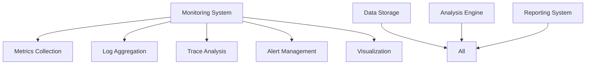
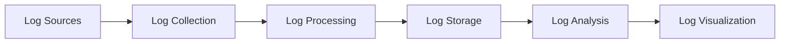

# Monitoring and Observability Framework

## 1. Overview

### 1.1 Purpose
The Monitoring Framework provides comprehensive system visibility through:
- Real-time monitoring
- Performance tracking
- Error detection
- Resource utilization
- System health

### 1.2 Framework Architecture

## 2. Metrics Collection

### 2.1 System Metrics
- **Resource Metrics**
  - CPU utilization
  - Memory usage
  - Disk I/O
  - Network traffic
  - Thread count

- **Performance Metrics**
  - Response time
  - Throughput
  - Latency
  - Error rate
  - Queue length

### 2.2 Business Metrics
- **Operation Metrics**
  - Request rate
  - Success rate
  - Failure rate
  - Processing time
  - Queue depth

- **Quality Metrics**
  - Accuracy rate
  - Precision rate
  - Recall rate
  - F1 score
  - Quality score

## 3. Log Management

### 3.1 Log Collection

### 3.2 Log Types
- **System Logs**
  - Error logs
  - Debug logs
  - Info logs
  - Warn logs
  - Fatal logs

- **Application Logs**
  - Request logs
  - Response logs
  - Process logs
  - Event logs
  - Audit logs

## 4. Tracing Framework

### 4.1 Trace Collection
- **Trace Components**
  - Span collection
  - Context propagation
  - Sampling strategy
  - Correlation IDs
  - Trace storage

- **Trace Analysis**
  - Path analysis
  - Bottleneck detection
  - Error tracking
  - Performance analysis
  - Dependency mapping

### 4.2 Trace Management
- **Trace Operations**
  - Trace filtering
  - Trace aggregation
  - Trace correlation
  - Trace visualization
  - Trace export

- **Trace Storage**
  - Storage strategy
  - Retention policy
  - Access control
  - Data protection
  - Archive policy

## 5. Alert Management

### 5.1 Alert Configuration
- **Alert Rules**
  - Threshold alerts
  - Trend alerts
  - Anomaly alerts
  - Pattern alerts
  - Composite alerts

- **Alert Routing**
  - Severity levels
  - Team routing
  - Escalation paths
  - Notification channels
  - Alert grouping

### 5.2 Alert Response
- **Response Process**
  - Alert detection
  - Alert validation
  - Response action
  - Resolution tracking
  - Post-mortem analysis

- **Response Automation**
  - Auto-remediation
  - Self-healing
  - Fallback actions
  - Recovery procedures
  - Validation checks

## 6. Visualization

### 6.1 Dashboard Types
- **System Dashboards**
  - Resource usage
  - Performance metrics
  - Error rates
  - System health
  - Service status

- **Business Dashboards**
  - Operation metrics
  - Quality metrics
  - SLA compliance
  - Business KPIs
  - Trend analysis

### 6.2 Visualization Features
- **Display Options**
  - Real-time views
  - Historical views
  - Trend views
  - Comparison views
  - Drill-down views

- **Interaction Options**
  - Filtering
  - Sorting
  - Grouping
  - Aggregation
  - Export

## 7. Analysis Framework

### 7.1 Analysis Types
- **Performance Analysis**
  - Latency analysis
  - Throughput analysis
  - Resource analysis
  - Bottleneck analysis
  - Capacity analysis

- **Error Analysis**
  - Error patterns
  - Root cause analysis
  - Impact analysis
  - Resolution analysis
  - Prevention analysis

### 7.2 Analysis Tools
- **Analysis Methods**
  - Statistical analysis
  - Pattern recognition
  - Trend analysis
  - Correlation analysis
  - Prediction analysis

- **Analysis Automation**
  - Auto-analysis
  - Report generation
  - Alert correlation
  - Problem detection
  - Solution suggestion

## 8. Data Management

### 8.1 Data Collection
- **Collection Methods**
  - Push collection
  - Pull collection
  - Event streaming
  - Batch processing
  - Real-time processing

- **Data Processing**
  - Data filtering
  - Data aggregation
  - Data enrichment
  - Data correlation
  - Data transformation

### 8.2 Data Storage
- **Storage Types**
  - Time-series data
  - Log data
  - Trace data
  - Metric data
  - Event data

- **Storage Management**
  - Data retention
  - Data archival
  - Data backup
  - Data recovery
  - Data cleanup

## 9. Success Criteria

### 9.1 System Quality
- **Availability Goals**
  - System uptime > 99.9%
  - Alert accuracy > 99%
  - Data freshness < 1m
  - Query response < 1s
  - Dashboard load < 2s

- **Performance Goals**
  - CPU usage < 70%
  - Memory usage < 80%
  - Storage usage < 75%
  - Network latency < 100ms
  - Error rate < 0.1%

### 9.2 Operational Quality
- **Process Goals**
  - Alert response < 5m
  - Issue resolution < 1h
  - Data retention > 30d
  - Report generation < 1m
  - Analysis time < 5m

- **Quality Goals**
  - Data accuracy > 99.9%
  - Alert precision > 95%
  - Analysis accuracy > 90%
  - Prediction accuracy > 85%
 