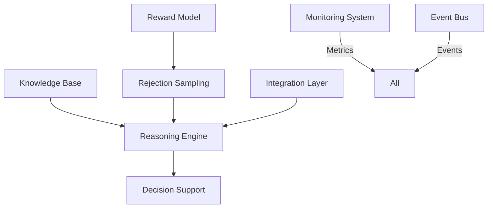
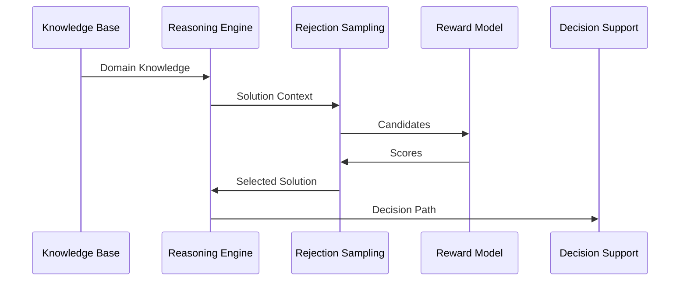

# Integration Patterns Specification

## 1. Overview

### 1.1 Purpose
The Integration Patterns define the communication and interaction between components:
- Component communication protocols
- Data flow patterns
- Event handling mechanisms
- Error management
- Resource coordination

### 1.2 System Architecture

## 2. Communication Patterns

### 2.1 Synchronous Patterns
- **Request-Response**
  - Direct API calls
  - Function invocations
  - Blocking operations
  - Response handling
  - Timeout management

- **Circuit Breaker**
  - Failure detection
  - Fallback mechanisms
  - Recovery procedures
  - State management
  - Health monitoring

### 2.2 Asynchronous Patterns
- **Event-Driven**
  - Event publication
  - Subscription management
  - Event handling
  - Queue management
  - Error recovery

- **Message Queue**
  - Message routing
  - Priority handling
  - Delivery guarantees
  - Flow control
  - Dead letter handling

## 3. Data Flow Patterns

### 3.1 Component Integration

### 3.2 Data Transformation
- **Format Conversion**
  - Data serialization
  - Schema mapping
  - Type conversion
  - Validation rules
  - Error handling

- **Data Enrichment**
  - Context addition
  - Metadata augmentation
  - Reference resolution
  - Quality enhancement
  - Validation checks

## 4. Event Handling

### 4.1 Event Types
- **System Events**
  - Component status
  - Resource state
  - Error conditions
  - Performance metrics
  - Health status

- **Business Events**
  - Decision points
  - Solution generation
  - Quality evaluation
  - Resource allocation
  - Process completion

### 4.2 Event Processing
- **Event Flow**
  - Event capture
  - Event routing
  - Event processing
  - State updates
  - Response generation

- **Error Handling**
  - Error detection
  - Error classification
  - Recovery procedures
  - State restoration
  - Notification system

## 5. Resource Management

### 5.1 Resource Allocation
- **Compute Resources**
  - CPU allocation
  - Memory management
  - Thread pooling
  - Process scheduling
  - Load balancing

- **Storage Resources**
  - Data persistence
  - Cache management
  - File handling
  - Backup systems
  - Archive management

### 5.2 Resource Coordination
- **Locking Mechanisms**
  - Resource locking
  - Deadlock prevention
  - Priority management
  - Timeout handling
  - Release procedures

- **Transaction Management**
  - ACID properties
  - Transaction scope
  - Rollback procedures
  - Consistency checks
  - Recovery points

## 6. Error Management

### 6.1 Error Handling
- **Error Types**
  - System errors
  - Business errors
  - Integration errors
  - Resource errors
  - Security errors

- **Recovery Procedures**
  - Error detection
  - Impact assessment
  - Recovery strategy
  - State restoration
  - Service restoration

### 6.2 Resilience Patterns
- **Retry Pattern**
  - Retry policies
  - Backoff strategies
  - Failure thresholds
  - Success criteria
  - Timeout limits

- **Fallback Pattern**
  - Alternative paths
  - Degraded modes
  - Service substitution
  - Data recovery
  - State management

## 7. Security Integration

### 7.1 Security Patterns
- **Authentication**
  - Identity verification
  - Token management
  - Session handling
  - Access control
  - Audit logging

- **Authorization**
  - Permission checking
  - Role management
  - Resource access
  - Policy enforcement
  - Security logging

### 7.2 Data Protection
- **Encryption**
  - Data encryption
  - Key management
  - Secure transport
  - Storage security
  - Access logging

- **Privacy**
  - Data masking
  - Access control
  - Audit trails
  - Compliance checks
  - Data lifecycle

## 8. Monitoring Integration

### 8.1 Metrics Collection
- **System Metrics**
  - Resource usage
  - Performance data
  - Error rates
  - Response times
  - Queue lengths

- **Business Metrics**
  - Decision quality
  - Solution accuracy
  - Processing time
  - Resource efficiency
  - Success rates

### 8.2 Observability
- **Logging**
  - Log levels
  - Log formats
  - Log routing
  - Log storage
  - Log analysis

- **Tracing**
  - Request tracing
  - Path analysis
  - Performance tracking
  - Error tracing
  - Dependency mapping

## 9. Success Criteria

### 9.1 Integration Quality
- **Performance**
  - Response time < 100ms
  - Throughput > 1000 ops/s
  - Error rate < 0.1%
  - Resource usage < 80%
  - Availability > 99.9%

- **Reliability**
  - Recovery time < 2s
  - Data consistency 100%
  - Event delivery > 99.9%
  - Transaction success > 99.9%
  - Backup success > 99.9%

### 9.2 Operational Quality
- **Monitoring**
  - Complete coverage
  - Real-time alerts
  - Metric collection
  - Log aggregation
  - Performance tracking

- **Maintenance**
  - Easy deployment
  - Quick recovery
  - Simple scaling
  - Clear documentation
  - Effective support 