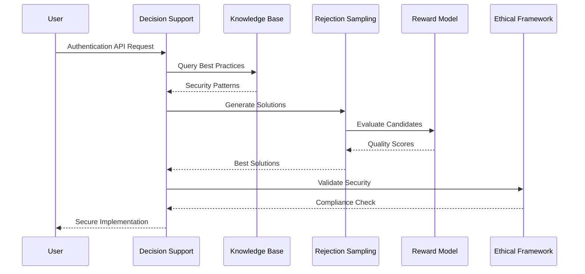
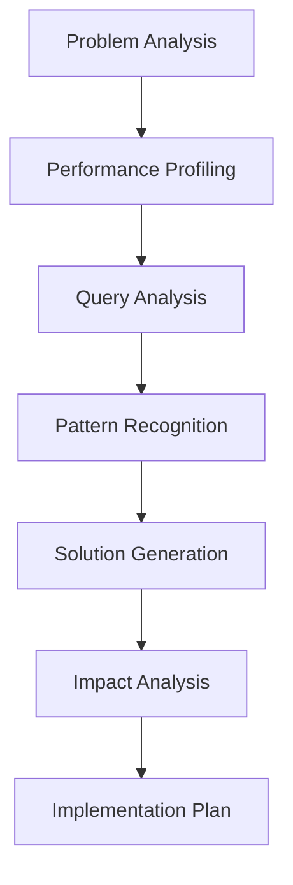
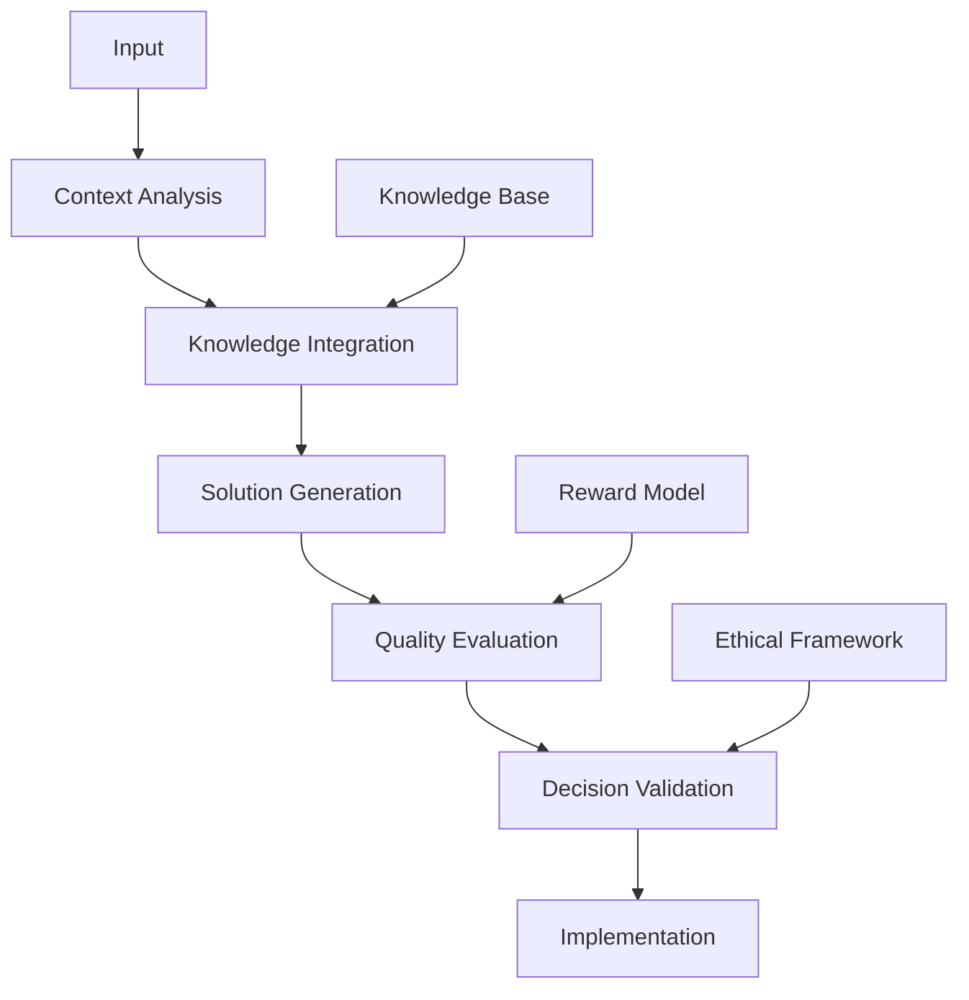

# Practical Implementation Scenarios

## 1. Code Generation Scenario

### 1.1 Problem Context
**User Request:** "Create a secure REST API endpoint for user authentication using JWT tokens"

### 1.2 Framework Interaction


### 1.3 Implementation Process
```typescript
// 1. Context Analysis
const context = {
  requirement: "Secure JWT authentication endpoint",
  constraints: [
    { type: "security", level: "high" },
    { type: "performance", maxLatency: "100ms" }
  ],
  patterns: ["JWT", "REST", "Authentication"]
};

// 2. Knowledge Base Query
const securityPatterns = await knowledgeBase.query({
  domain: "security",
  patterns: ["authentication", "JWT"],
  bestPractices: true
});

// 3. Solution Generation
const candidates = await rejectionSampling.generate({
  context,
  patterns: securityPatterns,
  count: 10
});

// 4. Quality Evaluation
const evaluatedSolutions = await rewardModel.evaluate(candidates, {
  criteria: ["security", "performance", "maintainability"]
});

// 5. Best Solution Selection
const bestSolution = evaluatedSolutions
  .filter(solution => solution.securityScore > 0.95)
  .sort((a, b) => b.overallScore - a.overallScore)[0];
```

### 1.4 Generated Solution
```typescript
// Example of generated secure authentication endpoint
import { Router } from 'express';
import jwt from 'jsonwebtoken';
import { hash, compare } from 'bcrypt';
import { validate } from 'class-validator';

export class AuthController {
  private readonly router: Router;
  private readonly JWT_SECRET: string;
  private readonly JWT_EXPIRY: string;

  constructor() {
    this.router = Router();
    this.JWT_SECRET = process.env.JWT_SECRET!;
    this.JWT_EXPIRY = '24h';
    this.initializeRoutes();
  }

  private initializeRoutes() {
    this.router.post('/login', this.login);
    this.router.post('/register', this.register);
  }

  private async login(req: Request, res: Response) {
    try {
      const { email, password } = req.body;
      
      // Input validation
      const errors = await validate({ email, password });
      if (errors.length > 0) {
        return res.status(400).json({ errors });
      }

      // User lookup and password verification
      const user = await UserRepository.findByEmail(email);
      if (!user || !await compare(password, user.password)) {
        return res.status(401).json({ 
          message: 'Invalid credentials' 
        });
      }

      // Token generation
      const token = jwt.sign(
        { userId: user.id },
        this.JWT_SECRET,
        { expiresIn: this.JWT_EXPIRY }
      );

      return res.json({ token });
    } catch (error) {
      return res.status(500).json({ 
        message: 'Internal server error' 
      });
    }
  }
}
```

## 2. Problem-Solving Scenario

### 2.1 Problem Context
**User Request:** "Optimize database queries that are causing performance issues in the user dashboard"

### 2.2 Analysis Process


### 2.3 Framework Interaction
```typescript
// 1. Problem Analysis
const performanceIssue = {
  type: "database_performance",
  component: "user_dashboard",
  symptoms: ["high_latency", "timeout_errors"],
  metrics: {
    avgResponseTime: "2.5s",
    errorRate: "5%",
    concurrentUsers: 100
  }
};

// 2. Root Cause Analysis
const analysis = await contextEngine.analyze(performanceIssue);
const queryPatterns = await knowledgeBase.findPatterns(analysis);

// 3. Solution Generation
const optimizationCandidates = await solutionGenerator.generate({
  context: analysis,
  patterns: queryPatterns,
  constraints: {
    maxResponseTime: "200ms",
    maxResourceUsage: "70%"
  }
});

// 4. Solution Evaluation
const evaluatedSolutions = await qualityEvaluator.evaluate(
  optimizationCandidates,
  {
    metrics: ["performance", "reliability", "maintainability"],
    weights: { performance: 0.6, reliability: 0.3, maintainability: 0.1 }
  }
);
```

### 2.4 Generated Solution
```typescript
// Example of optimized query implementation
class DashboardQueryOptimizer {
  async getUserDashboardData(userId: string): Promise<DashboardData> {
    // 1. Implement query caching
    const cacheKey = `dashboard:${userId}`;
    const cachedData = await cache.get(cacheKey);
    if (cachedData) return cachedData;

    // 2. Optimize database queries
    const [
      userProfile,
      recentActivity,
      notifications
    ] = await Promise.all([
      this.getUserProfile(userId),
      this.getRecentActivity(userId),
      this.getNotifications(userId)
    ]);

    // 3. Implement data aggregation
    const dashboardData = {
      profile: userProfile,
      activity: this.aggregateActivity(recentActivity),
      notifications: this.filterNotifications(notifications)
    };

    // 4. Cache the results
    await cache.set(cacheKey, dashboardData, '15m');
    
    return dashboardData;
  }

  private aggregateActivity(activity: Activity[]): AggregatedActivity {
    // Implement efficient data aggregation
    return activity.reduce((acc, curr) => {
      // Aggregation logic
    }, {});
  }
}
```

## 3. Decision-Making Process

### 3.1 Framework Integration


### 3.2 Quality Assurance
```typescript
// Quality assurance process
class QualityAssurance {
  async validateSolution(solution: Solution): Promise<ValidationResult> {
    // 1. Code quality check
    const codeQuality = await this.analyzeCodeQuality(solution.code);
    
    // 2. Performance testing
    const performanceMetrics = await this.testPerformance(solution);
    
    // 3. Security validation
    const securityScore = await this.validateSecurity(solution);
    
    // 4. Resource impact analysis
    const resourceImpact = await this.analyzeResourceUsage(solution);
    
    // 5. Maintainability assessment
    const maintainability = await this.assessMaintainability(solution);
    
    return {
      isValid: this.meetsThresholds({
        codeQuality,
        performanceMetrics,
        securityScore,
        resourceImpact,
        maintainability
      }),
      metrics: {
        codeQuality,
        performanceMetrics,
        securityScore,
        resourceImpact,
        maintainability
      }
    };
  }
}
```

## 4. Success Metrics

### 4.1 Performance Metrics
- Solution generation time: < 100ms
- Quality evaluation time: < 50ms
- Decision validation time: < 50ms
- Implementation accuracy: > 95%
- Resource efficiency: > 90%

### 4.2 Quality Metrics
- Code quality score: > 90%
- Test coverage: > 95%
- Security compliance: 100%
- Documentation coverage: > 95%
- Maintainability index: > 85% 