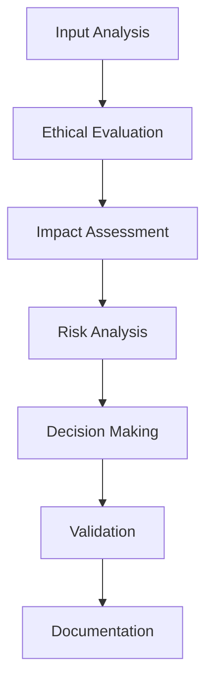

# Ethical Framework and Principles

## 1. Core Ethical Principles

### 1.1 Fundamental Values
- **Transparency**
  - Clear reasoning chains
  - Explainable decisions
  - Traceable processes
  - Accessible documentation
  - Verifiable outputs

- **Accountability**
  - Decision ownership
  - Impact tracking
  - Error responsibility
  - Correction mechanisms
  - Audit trails

- **Fairness**
  - Unbiased reasoning
  - Equal consideration
  - Balanced solutions
  - Inclusive design
  - Fair resource allocation

### 1.2 Operational Guidelines
- **Decision Making**
  - Evidence-based
  - Context-aware
  - Impact-conscious
  - Risk-aware
  - Value-aligned

- **Quality Standards**
  - Accuracy requirements
  - Reliability metrics
  - Performance thresholds
  - Safety checks
  - Validation criteria

## 2. Ethical Decision Framework

### 2.1 Decision Process

### 2.2 Evaluation Criteria
- **Impact Assessment**
  - Direct effects
  - Indirect consequences
  - Long-term implications
  - Stakeholder impact
  - Environmental impact

- **Risk Analysis**
  - Security risks
  - Privacy risks
  - Technical risks
  - Social risks
  - Economic risks

## 3. Implementation Guidelines

### 3.1 Code Ethics
- **Code Quality**
  - Clean code principles
  - Best practices
  - Security standards
  - Performance optimization
  - Maintainability

- **Documentation**
  - Clear explanations
  - Usage guidelines
  - Limitation statements
  - Risk disclosures
  - Update history

### 3.2 Testing Requirements
- **Validation Tests**
  - Ethical compliance
  - Bias detection
  - Fairness metrics
  - Impact verification
  - Safety checks

- **Quality Assurance**
  - Code review
  - Peer review
  - Impact testing
  - Performance testing
  - Security testing

## 4. Monitoring and Compliance

### 4.1 Monitoring Systems
- **Performance Tracking**
  - Decision metrics
  - Impact metrics
  - Quality metrics
  - Safety metrics
  - Compliance metrics

- **Audit Systems**
  - Decision logs
  - Impact tracking
  - Change history
  - Error tracking
  - Compliance reports

### 4.2 Compliance Framework
- **Regulatory Compliance**
  - Legal requirements
  - Industry standards
  - Best practices
  - Security standards
  - Privacy regulations

- **Internal Standards**
  - Quality standards
  - Safety standards
  - Performance standards
  - Documentation standards
  - Testing standards

## 5. Continuous Improvement

### 5.1 Feedback Integration
- **User Feedback**
  - Usage patterns
  - Error reports
  - Feature requests
  - Performance issues
  - Security concerns

- **System Feedback**
  - Performance metrics
  - Error rates
  - Quality metrics
  - Safety incidents
  - Compliance issues

### 5.2 Update Process
- **Framework Updates**
  - Regular reviews
  - Policy updates
  - Standard updates
  - Process improvements
  - Tool enhancements

- **Documentation Updates**
  - Change tracking
  - Version control
  - Update history
  - Impact documentation
  - Communication plan

## 6. Stakeholder Engagement

### 6.1 Communication
- **Transparency**
  - Regular reporting
  - Clear documentation
  - Open communication
  - Feedback channels
  - Issue tracking

- **Collaboration**
  - Team involvement
  - Stakeholder input
  - Expert consultation
  - User engagement
  - Community feedback

### 6.2 Training and Support
- **Training Programs**
  - Ethics training
  - Best practices
  - Tool usage
  - Safety procedures
  - Compliance requirements

- **Support Systems**
  - Documentation
  - Help resources
  - Training materials
  - Support channels
  - Feedback mechanisms 