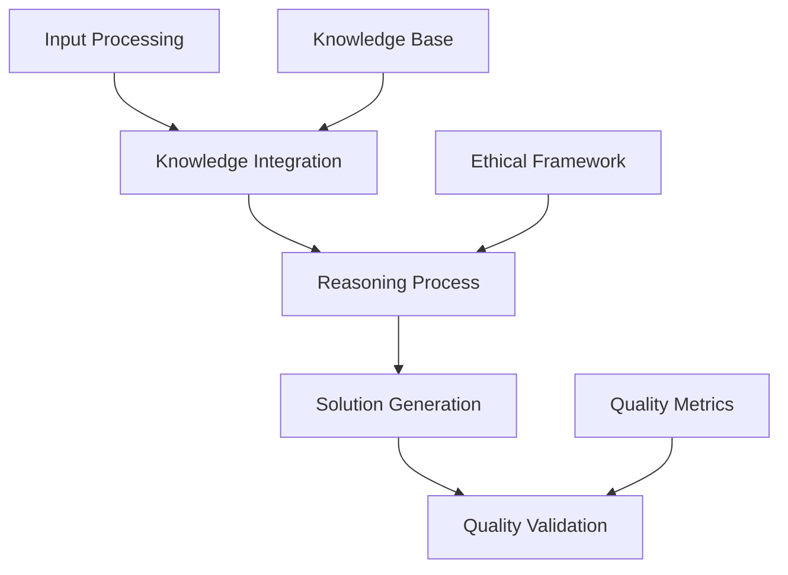
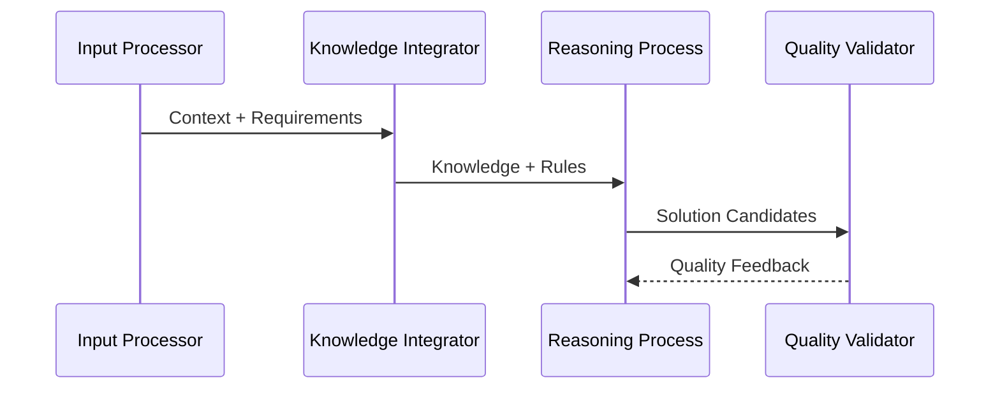

# Reasoning Engine Specification

## 1. Overview

### 1.1 Purpose

The Reasoning Engine provides the core logical processing capabilities for:

- Constructing logical reasoning chains
- Making evidence-based decisions
- Validating solution quality
- Ensuring ethical compliance
- Learning from experience

### 1.2 Core Architecture

## 2. Reasoning Components

### 2.1 Logical Processing

- **Deductive Reasoning**
  - Rule application
  - Logical inference
  - Constraint validation
  - Pattern matching
  - Solution verification

- **Inductive Reasoning**
  - Pattern recognition
  - Generalization
  - Hypothesis formation
  - Learning integration
  - Model expansion

### 2.2 Knowledge Integration

- **Knowledge Types**
  - Domain knowledge
  - Procedural knowledge
  - Contextual knowledge
  - Historical knowledge
  - Ethical principles

- **Integration Methods**
  - Pattern matching
  - Context mapping
  - Rule application
  - Evidence linking
  - Validation checking

## 3. Processing Pipeline

### 3.1 Input Processing

### 3.2 Solution Generation

- **Generation Process**
  - Context analysis
  - Pattern matching
  - Rule application
  - Solution synthesis
  - Quality validation

- **Quality Control**
  - Logical validation
  - Ethical compliance
  - Quality metrics
  - Performance checks
  - Resource validation

## 4. Quality Framework

### 4.1 Validation Process

- **Logic Validation**
  - Consistency checking
  - Completeness verification
  - Soundness validation
  - Pattern verification
  - Rule compliance

- **Quality Metrics**
  - Logical consistency
  - Solution completeness
  - Ethical alignment
  - Performance efficiency
  - Resource utilization

### 4.2 Performance Requirements

- **Processing Speed**
  - Simple inference: < 50ms
  - Complex reasoning: < 200ms
  - Pattern matching: < 100ms
  - Quality validation: < 50ms
  - Total pipeline: < 500ms

- **Resource Usage**
  - Memory efficiency
  - CPU utilization
  - Storage optimization
  - Network efficiency
  - Cache utilization

## 5. Integration Points

### 5.1 Internal Systems

- **Core Systems**
  - Knowledge Base
  - Ethical Framework
  - Quality Assurance
  - Learning System
  - Monitoring System

- **Support Systems**
  - Caching System
  - Logging System
  - Metrics System
  - Storage System
  - Recovery System

### 5.2 External Systems

- **Integration Types**
  - Knowledge sources
  - Validation systems
  - Learning systems
  - Monitoring tools
  - Analysis tools

## 6. Implementation Guidelines

### 6.1 Development Standards

- **Code Quality**
  - Clean architecture
  - SOLID principles
  - Design patterns
  - Error handling
  - Performance optimization

- **Testing Requirements**
  - Unit testing
  - Integration testing
  - Performance testing
  - Quality validation
  - Security testing

### 6.2 Deployment Requirements

- **System Requirements**
  - Processing power
  - Memory allocation
  - Storage capacity
  - Network bandwidth
  - Cache configuration

- **Monitoring Setup**
  - Performance metrics
  - Quality metrics
  - Resource usage
  - Error tracking
  - Usage patterns

## 7. Success Criteria

### 7.1 Performance Goals

- **Processing Metrics**
  - Reasoning accuracy > 95%
  - Response time < 500ms
  - Resource usage < 70%
  - Error rate < 1%
  - Cache hit rate > 80%

- **Quality Metrics**
  - Logic validation > 98%
  - Pattern matching > 90%
  - Rule compliance > 95%
  - Ethical alignment > 99%
  - Resource efficiency > 85%

### 7.2 Operational Goals

- **System Health**
  - Availability > 99.9%
  - Recovery time < 1s
  - Data consistency 100%
  - Backup success > 99%
  - Update success > 99%

- **Quality Standards**
  - Code coverage > 90%
  - Documentation complete
  - Tests comprehensive
  - Security hardened
  - Performance optimized