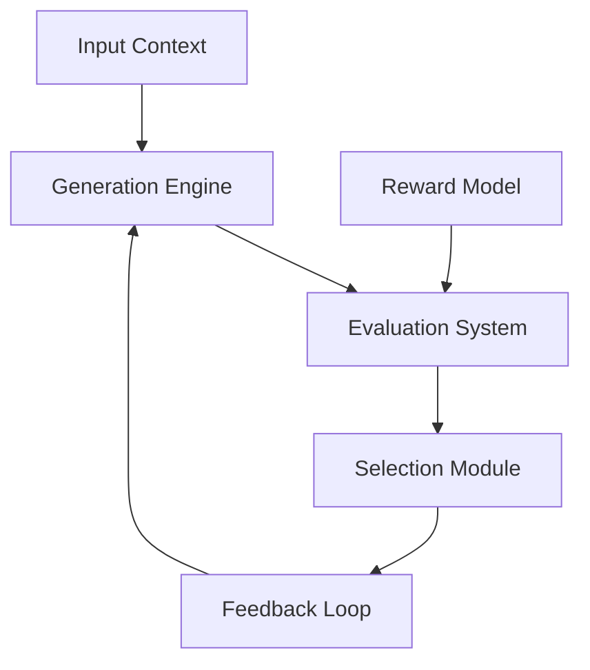

# Rejection Sampling Framework

## 1. Overview

### 1.1 Purpose
The Rejection Sampling Framework provides a systematic approach for:
- Generating and evaluating multiple solution candidates
- Selecting optimal reasoning paths
- Improving decision quality
- Enhancing model alignment
- Ensuring ethical compliance

### 1.2 Core Components

## 2. Mathematical Framework

### 2.1 Completion Generation
For each decision point requiring \(M\) contexts and \(N\) completions per context:

\[Y = \begin{bmatrix} 
y_{1,1} & y_{1,2} & \cdots & y_{1,N} \\ 
y_{2,1} & y_{2,2} & \cdots & y_{2,N} \\ 
\vdots & \vdots & \ddots & \vdots \\ 
y_{M,1} & y_{M,2} & \cdots & y_{M,N} 
\end{bmatrix}\]

### 2.2 Reward Calculation
For each completion, evaluate using reward model \(\mathcal{R}\):

\[r_{i,j} = \mathcal{R}(y_{i,j}|x_i)\]

Where:
- \(r_{i,j}\) is the reward score
- \(y_{i,j}\) is the completion
- \(x_i\) is the input context

## 3. Implementation Components

### 3.1 Generation Engine
- **Completion Generator**
  - Context analysis
  - Parameter tuning
  - Diversity control
  - Quality thresholds
  - Resource management

- **Sampling Parameters**
  - Temperature range: 0.7-1.0
  - Completion count: 10-30
  - Quality thresholds
  - Diversity metrics
  - Resource limits

### 3.2 Evaluation System
- **Reward Model**
  - Quality assessment
  - Alignment verification
  - Ethical compliance
  - Performance metrics
  - Safety checks

- **Evaluation Criteria**
  - Solution effectiveness
  - Implementation feasibility
  - Resource efficiency
  - Ethical alignment
  - Risk assessment

## 4. Selection Process

### 4.1 Filtering Mechanism

### 4.2 Selection Criteria
- **Quality Metrics**
  - Reward score thresholds
  - Confidence levels
  - Implementation feasibility
  - Resource requirements
  - Risk factors

- **Alignment Checks**
  - Ethical compliance
  - Goal alignment
  - Context relevance
  - Safety requirements
  - Performance bounds

## 5. Integration Points

### 5.1 Decision Framework Integration
- **Decision Points**
  - Solution generation
  - Path selection
  - Risk assessment
  - Quality control
  - Performance optimization

- **Integration Methods**
  - API endpoints
  - Event triggers
  - Callback systems
  - Monitoring hooks
  - Feedback loops

### 5.2 System Components
- **Core Systems**
  - Reasoning engine
  - Knowledge base
  - Learning system
  - Monitoring system
  - Feedback system

- **External Systems**
  - Model training
  - Data collection
  - Performance monitoring
  - Quality assurance
  - Audit logging

## 6. Quality Control

### 6.1 Performance Metrics
- **Generation Metrics**
  - Completion diversity
  - Generation speed
  - Resource usage
  - Quality distribution
  - Error rates

- **Selection Metrics**
  - Selection accuracy
  - Decision quality
  - Processing time
  - Resource efficiency
  - Error recovery

### 6.2 Monitoring Systems
- **Real-time Monitoring**
  - Performance tracking
  - Resource usage
  - Error detection
  - Quality metrics
  - System health

- **Audit Systems**
  - Decision logs
  - Selection history
  - Performance data
  - Error tracking
  - Quality metrics

## 7. Optimization Process

### 7.1 Parameter Tuning
- **Generation Parameters**
  - Temperature adjustment
  - Sample size optimization
  - Quality thresholds
  - Resource allocation
  - Performance targets

- **Selection Parameters**
  - Reward thresholds
  - Confidence levels
  - Risk tolerances
  - Quality requirements
  - Performance bounds

### 7.2 Model Updates
- **Reward Model**
  - Regular training
  - Performance tuning
  - Bias correction
  - Quality improvement
  - Alignment enhancement

- **Generation Model**
  - Parameter optimization
  - Quality improvement
  - Resource efficiency
  - Performance tuning
  - Error reduction

## 8. Success Criteria

### 8.1 Performance Goals
- **Quality Metrics**
  - Decision accuracy > 95%
  - Processing time < 100ms
  - Resource efficiency > 90%
  - Error rate < 1%
  - Alignment score > 0.95

- **System Metrics**
  - Availability > 99.9%
  - Response time < 50ms
  - Resource usage < 80%
  - Error recovery < 1s
  - Data consistency 100%

### 8.2 Quality Standards
- **Implementation Standards**
  - Code quality
  - Documentation
  - Testing coverage
  - Performance
  - Security

- **Operational Standards**
  - Monitoring
  - Maintenance
  - Updates
  - Support
  - Training 