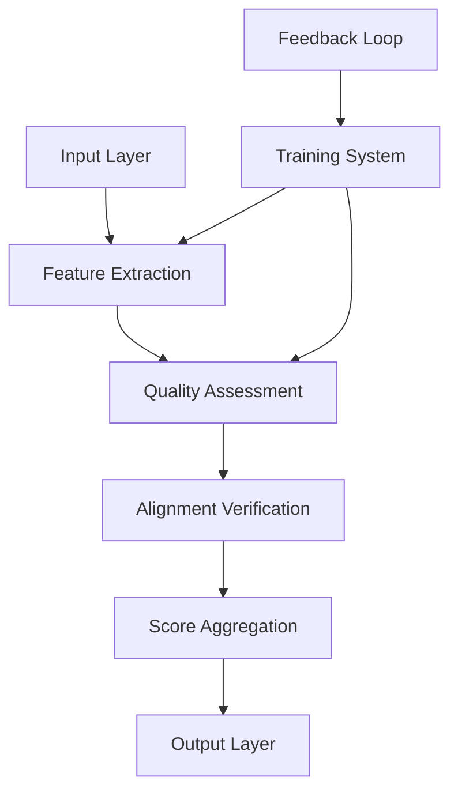
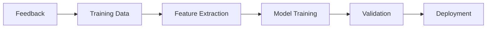

# Reward Model Specification

## 1. Overview

### 1.1 Purpose
The Reward Model provides systematic evaluation of solution candidates by:
- Assessing solution quality and alignment
- Calculating reward scores for candidates
- Enforcing quality standards
- Ensuring ethical compliance
- Guiding model optimization

### 1.2 Core Components

## 2. Mathematical Framework

### 2.1 Reward Function
The reward function \(\mathcal{R}\) computes a composite score:

\[r = \mathcal{R}(y|x) = \sum_{i=1}^{n} w_i \cdot f_i(y,x)\]

Where:
- \(r\) is the final reward score
- \(w_i\) are component weights
- \(f_i\) are scoring functions
- \(y\) is the candidate solution
- \(x\) is the input context

### 2.2 Component Functions
Key scoring components include:

1. Quality Score:
\[f_q(y,x) = \alpha \cdot q(y) + (1-\alpha) \cdot c(y|x)\]

2. Alignment Score:
\[f_a(y,x) = \beta \cdot a(y) + (1-\beta) \cdot e(y)\]

3. Resource Score:
\[f_r(y) = \gamma \cdot m(y) + (1-\gamma) \cdot p(y)\]

Where:
- \(q(y)\): Quality function
- \(c(y|x)\): Context relevance
- \(a(y)\): Alignment function
- \(e(y)\): Ethical compliance
- \(m(y)\): Memory efficiency
- \(p(y)\): Processing efficiency

## 3. Implementation Components

### 3.1 Feature Extraction
- **Code Analysis**
  - Structural features
  - Semantic features
  - Complexity metrics
  - Quality indicators
  - Performance markers

- **Context Processing**
  - Domain features
  - Project context
  - Requirements mapping
  - Constraint analysis
  - Resource bounds

### 3.2 Quality Assessment
- **Code Quality**
  - Style compliance
  - Best practices
  - Error handling
  - Documentation
  - Maintainability

- **Solution Quality**
  - Correctness
  - Completeness
  - Efficiency
  - Scalability
  - Robustness

### 3.3 Alignment Verification
- **Goal Alignment**
  - Requirements match
  - Constraint satisfaction
  - Objective fulfillment
  - Context fit
  - User alignment

- **Ethical Alignment**
  - Bias checking
  - Fairness metrics
  - Safety compliance
  - Privacy protection
  - Security standards

## 4. Training Framework

### 4.1 Training Process

### 4.2 Training Components
- **Data Collection**
  - Solution examples
  - Expert feedback
  - User ratings
  - Performance metrics
  - Error reports

- **Model Training**
  - Parameter optimization
  - Weight adjustment
  - Bias correction
  - Performance tuning
  - Validation checks

## 5. Integration Interface

### 5.1 Input Interface
- **Solution Input**
  - Code segments
  - Documentation
  - Test cases
  - Resource metrics
  - Context data

- **Context Input**
  - Project requirements
  - System constraints
  - User preferences
  - Resource limits
  - Quality standards

### 5.2 Output Interface
- **Score Output**
  - Quality scores
  - Alignment scores
  - Resource scores
  - Composite scores
  - Confidence levels

- **Feedback Output**
  - Improvement suggestions
  - Error notifications
  - Warning indicators
  - Performance insights
  - Resource recommendations

## 6. Quality Control

### 6.1 Validation Process
- **Model Validation**
  - Accuracy testing
  - Consistency checking
  - Bias detection
  - Performance validation
  - Resource monitoring

- **Output Validation**
  - Score verification
  - Feedback validation
  - Alignment checking
  - Resource verification
  - Impact assessment

### 6.2 Monitoring System
- **Performance Monitoring**
  - Response time
  - Resource usage
  - Accuracy metrics
  - Error rates
  - Throughput

- **Quality Monitoring**
  - Score distribution
  - Feedback quality
  - Alignment accuracy
  - Resource efficiency
  - User satisfaction

## 7. Optimization Process

### 7.1 Model Updates
- **Regular Updates**
  - Weight adjustment
  - Feature refinement
  - Parameter tuning
  - Performance optimization
  - Resource balancing

- **Feedback Integration**
  - User feedback
  - System metrics
  - Error patterns
  - Performance data
  - Resource usage

### 7.2 Continuous Improvement
- **Model Evolution**
  - Feature expansion
  - Algorithm refinement
  - Context adaptation
  - Performance enhancement
  - Resource optimization

- **Quality Enhancement**
  - Accuracy improvement
  - Bias reduction
  - Consistency enhancement
  - Performance tuning
  - Resource efficiency

## 8. Success Criteria

### 8.1 Performance Metrics
- **Accuracy Metrics**
  - Score accuracy > 95%
  - Alignment accuracy > 90%
  - Resource prediction > 85%
  - Error rate < 1%
  - Bias score < 0.1

- **Operational Metrics**
  - Response time < 50ms
  - Resource usage < 70%
  - Update time < 1s
  - Recovery time < 2s
  - Availability > 99.9%

### 8.2 Quality Standards
- **Implementation Quality**
  - Code coverage > 90%
  - Documentation complete
  - Tests comprehensive
  - Performance optimized
  - Security hardened

- **Operational Quality**
  - Monitoring complete
  - Alerts configured
  - Backup systems ready
  - Recovery tested
  - Support established 