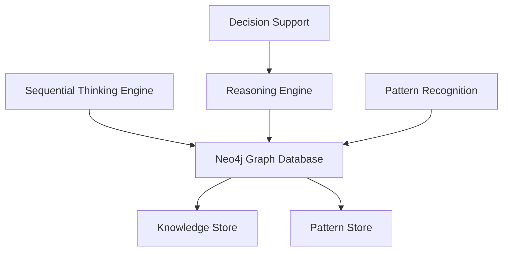

# Neo4j Sequential Thinking Framework

## Overview

This framework integrates sequential thinking capabilities with Neo4j graph database to create a powerful reasoning and knowledge management system. It combines pattern recognition, knowledge graph capabilities, and sequential reasoning to enhance AI decision-making processes.

## Architecture



## Setup Instructions

### Prerequisites

- Docker and Docker Compose
- Node.js (for development)
- Neo4j Browser (for visualization and debugging)

### Environment Configuration

1. Copy `.env.example` to `.env`:

   ```bash
   cp .env.example .env
   ```

2. Configure the following variables in `.env`:

   ```env
   NEO4J_AUTH=neo4j/your_secure_password
   NEO4J_USER=neo4j
   NEO4J_PASSWORD=your_secure_password
   ```

### Starting the System

1. Build and start the containers:

   ```bash
   docker-compose up -d
   ```

2. Access the services:

   - Neo4j Browser: http://localhost:7474

   - N8N Dashboard: http://localhost:5678

## Knowledge Graph Structure

### Core Entities

1. **Thoughts**
   - Represents individual thinking steps
   - Contains context and metadata
   - Linked in sequences

2. **Patterns**
   - Reusable reasoning patterns
   - Success metrics
   - Context applicability

3. **Sequences**
   - Connected thought chains
   - Branch points
   - Outcome tracking

### Relationships

- NEXT_STEP: Connects sequential thoughts
- APPLIES_PATTERN: Links thoughts to patterns
- BRANCHES_FROM: Marks decision points
- RELATED_CONCEPT: Links to domain concepts

## Usage Examples

### 1. Creating a New Thought Sequence

```cypher
CREATE (s:Sequence {
    id: randomUUID(),
    context: 'problem-solving',
    status: 'IN_PROGRESS'
})
CREATE (t:Thought {
    id: randomUUID(),
    stepNumber: 1,
    thought: 'Initial problem analysis',
    context: 'problem-solving'
})
CREATE (s)-[:CONTAINS]->(t)
```

### 2. Applying a Pattern

```cypher
MATCH (p:Pattern {name: 'Deductive Reasoning'})
MATCH (t:Thought {id: 'thought-id'})
CREATE (t)-[:APPLIES_PATTERN {
    confidence: 0.85,
    timestamp: datetime()
}]->(p)
```

### 3. Branching a Sequence

```cypher
MATCH (t:Thought {id: 'source-thought-id'})
CREATE (newT:Thought {
    id: randomUUID(),
    stepNumber: t.stepNumber + 1,
    thought: 'Alternative approach',
    context: t.context
})
CREATE (newT)-[:BRANCHES_FROM]->(t)
```

## Performance Optimization

### Indexes

The system automatically creates indexes for:

- Thought contexts
- Pattern names
- Sequence statuses
- Relationship types

### Query Optimization

- Use parameterized queries
- Leverage APOC procedures
- Implement caching where appropriate

## Monitoring

### Key Metrics

1. Pattern Usage
   - Success rates
   - Context applicability
   - Usage frequency

2. Sequence Performance
   - Completion rates
   - Branch points
   - Average confidence

3. System Health
   - Query response times
   - Memory usage
   - Cache hit rates

### Monitoring Tools

- Neo4j Metrics
- Prometheus integration
- Custom dashboards

## Development Guidelines

### Adding New Patterns

1. Define pattern structure
2. Implement validation rules
3. Add usage examples
4. Update documentation

### Extending the Framework

1. Follow modular design
2. Maintain type safety
3. Add comprehensive tests
4. Update schema documentation

## Troubleshooting

### Common Issues

1. Connection Problems

   ```bash
   # Check Neo4j status
   docker-compose ps neo4j
   # View logs
   docker-compose logs neo4j
   ```

2. Performance Issues

   ```cypher
   // Check query performance
   PROFILE MATCH (t:Thought)-[:NEXT_STEP*]->(end:Thought)
   WHERE t.context = 'problem-solving'
   RETURN t, end
   ```

3. Data Consistency

   ```cypher
   // Validate sequence integrity
   MATCH (s:Sequence)-[:CONTAINS]->(t:Thought)
   WHERE NOT exists(t.stepNumber)
   RETURN s, t
   ```

## Security Considerations

### Access Control

- Use role-based access
- Implement audit logging
- Regular security reviews

### Data Protection

- Encrypt sensitive data
- Regular backups
- Access monitoring

## Backup and Recovery

### Backup Process

```bash
# Create backup
docker-compose exec neo4j neo4j-admin dump --database=neo4j --to=/backups/backup.dump

# Restore from backup
docker-compose exec neo4j neo4j-admin load --from=/backups/backup.dump --database=neo4j --force
```

## Future Enhancements

### Planned Features

1. Advanced pattern recognition
2. Machine learning integration
3. Real-time analytics
4. Enhanced visualization tools

### Integration Points

1. External AI systems
2. Knowledge bases
3. Decision support tools
4. Monitoring systems
