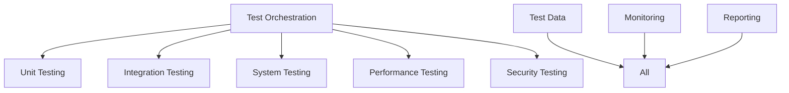
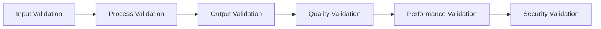

# Testing and Validation Framework

## 1. Overview

### 1.1 Purpose
The Testing Framework ensures system quality and reliability through:
- Comprehensive test coverage
- Validation procedures
- Quality assurance
- Performance verification
- Security validation

### 1.2 Framework Architecture

## 2. Test Levels

### 2.1 Unit Testing
- **Component Tests**
  - Function testing
  - Class testing
  - Module testing
  - Interface testing
  - State testing

- **Test Coverage**
  - Line coverage
  - Branch coverage
  - Path coverage
  - Condition coverage
  - Function coverage

### 2.2 Integration Testing
- **Component Integration**
  - Interface testing
  - Data flow testing
  - Error handling
  - State management
  - Resource coordination

- **System Integration**
  - Service integration
  - API testing
  - Event handling
  - Transaction flow
  - Error recovery

## 3. Validation Framework

### 3.1 Validation Process

### 3.2 Validation Types
- **Data Validation**
  - Schema validation
  - Type checking
  - Range validation
  - Format validation
  - Consistency checks

- **Process Validation**
  - Flow validation
  - State validation
  - Rule validation
  - Logic validation
  - Resource validation

## 4. Test Automation

### 4.1 Automation Framework
- **Test Infrastructure**
  - Test runners
  - Test frameworks
  - Mocking systems
  - Assertion libraries
  - Coverage tools

- **Continuous Testing**
  - Build integration
  - Test scheduling
  - Result reporting
  - Notification system
  - Issue tracking

### 4.2 Test Orchestration
- **Test Execution**
  - Test selection
  - Test ordering
  - Parallel execution
  - Resource management
  - Result collection

- **Test Management**
  - Test organization
  - Version control
  - Configuration management
  - Environment management
  - Data management

## 5. Performance Testing

### 5.1 Load Testing
- **Load Patterns**
  - Normal load
  - Peak load
  - Stress testing
  - Endurance testing
  - Spike testing

- **Performance Metrics**
  - Response time
  - Throughput
  - Resource usage
  - Error rates
  - Latency

### 5.2 Scalability Testing
- **Scale Testing**
  - Vertical scaling
  - Horizontal scaling
  - Load distribution
  - Resource allocation
  - Performance bounds

- **Capacity Planning**
  - Resource planning
  - Growth projection
  - Bottleneck analysis
  - Optimization planning
  - Cost analysis

## 6. Security Testing

### 6.1 Security Validation
- **Security Tests**
  - Authentication testing
  - Authorization testing
  - Encryption testing
  - Access control
  - Audit logging

- **Vulnerability Testing**
  - Penetration testing
  - Security scanning
  - Code analysis
  - Configuration review
  - Compliance checking

### 6.2 Privacy Testing
- **Data Protection**
  - Data handling
  - Privacy controls
  - Data lifecycle
  - Access patterns
  - Audit trails

- **Compliance Testing**
  - Regulatory compliance
  - Policy compliance
  - Standard compliance
  - Security compliance
  - Privacy compliance

## 7. Quality Assurance

### 7.1 Quality Gates
- **Code Quality**
  - Style checking
  - Code review
  - Static analysis
  - Complexity analysis
  - Documentation review

- **Process Quality**
  - Process validation
  - Standard compliance
  - Best practices
  - Error handling
  - Performance optimization

### 7.2 Quality Metrics
- **Quality Measures**
  - Defect density
  - Test coverage
  - Code quality
  - Documentation quality
  - Performance metrics

- **Quality Tracking**
  - Trend analysis
  - Quality scoring
  - Issue tracking
  - Resolution time
  - Improvement rate

## 8. Test Reporting

### 8.1 Report Types
- **Test Reports**
  - Execution summary
  - Coverage report
  - Error report
  - Performance report
  - Security report

- **Quality Reports**
  - Quality metrics
  - Trend analysis
  - Issue summary
  - Resolution status
  - Improvement tracking

### 8.2 Report Distribution
- **Distribution Methods**
  - Automated reports
  - Dashboard updates
  - Email notifications
  - Alert systems
  - Status updates

- **Stakeholder Access**
  - Role-based access
  - Report customization
  - Data filtering
  - Export options
  - Archive access

## 9. Success Criteria

### 9.1 Test Quality
- **Coverage Goals**
  - Unit test coverage > 90%
  - Integration test coverage > 85%
  - System test coverage > 80%
  - Security test coverage > 95%
  - Performance test coverage > 85%

- **Quality Goals**
  - Defect density < 0.1/KLOC
  - Test pass rate > 99%
  - Code quality score > 90%
  - Documentation coverage > 95%
  - Performance within SLA > 99.9%

### 9.2 Operational Quality
- **Process Goals**
  - Test automation > 90%
  - Report automation > 95%
  - Issue resolution < 24h
  - Test cycle time < 4h
  - Deployment success > 99%

- **Maintenance Goals**
  - Test maintenance < 10%
  - Framework updates < 4h
  - Environment setup < 1h
  - Data refresh < 2h
  - Recovery time < 15m 