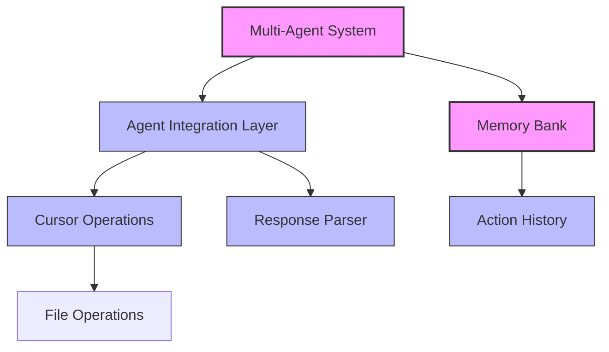

# Tutorial-Cursor Integration Architecture Overview

## Introduction

This document provides a high-level overview of the architecture for integrating Tutorial-Cursor's code operation capabilities into our multi-agent system. The integration is designed to enhance our agents' ability to read, analyze, and modify code while preserving our core multi-agent architecture.

## System Architecture

The integration follows a modular architecture with clear separation of concerns:

## Key Components

### 1. Cursor Operations Module

The Cursor Operations module provides a clean API for file-related operations:

- **File Reading**: Reading and parsing code files
- **Directory Listing**: Exploring directory structures
- **Code Search**: Finding relevant code snippets
- **Code Modification**: Making structured changes to code files

This module serves as the primary bridge between our system and Tutorial-Cursor's capabilities.

### 2. Agent Integration Layer

The Agent Integration layer connects individual agents to the Cursor Operations:

- **Agent Registry**: Manages agent registration and connection
- **Context Management**: Maintains context for each agent
- **Operation Execution**: Executes cursor operations on behalf of agents
- **History Tracking**: Records operation history for context preservation

### 3. Memory Bank Enhancement

The Memory Bank enhancements build upon our existing Memory Bank protocol:

- **Action History**: Tracks file operations and code modifications
- **Context Preservation**: Maintains context when switching between agents
- **Cross-Agent Awareness**: Ensures agents are aware of other agents' operations
- **Persistence**: Stores operation history for later reference

### 4. Response Parser

The Response Parser component handles structured responses from LLMs:

- **YAML Parsing**: Parses YAML-formatted responses
- **Tool Selection**: Identifies appropriate tools based on parsed content
- **Operation Planning**: Structures complex operations into steps
- **Validation**: Validates parsed content for security and correctness

## Integration Points

The system integrates with our existing multi-agent system at these points:

1. **Agent API**: Agents interact with Cursor capabilities through the Agent Integration Layer
2. **Memory Bank Protocol**: Extended to include action history and context preservation
3. **Development Agent**: Enhanced with Response Parser for improved code modification
4. **File System**: Both systems interact with the file system in a coordinated manner

## Data Flow

The typical data flow for a code operation:

1. Agent requests an operation through the Agent Integration Layer
2. The request is validated and transformed if necessary
3. The operation is executed by the Cursor Operations module
4. Results are returned to the agent
5. The operation is recorded in the Action History
6. The Memory Bank is updated to reflect the new context

## Design Considerations

- **Decoupling**: The architecture maintains clear boundaries between components
- **Extensibility**: New operations can be added to the Cursor Operations module
- **Error Handling**: Comprehensive error handling across all components
- **Security**: Operations validate inputs and outputs for security
- **Performance**: Efficient operations with appropriate caching and optimization

## Testing Approach

The integration includes comprehensive testing at multiple levels:

- **Unit Tests**: For individual functions and components
- **Integration Tests**: For workflow across components
- **System Tests**: For the full integration with the multi-agent system

## Next Steps

The architecture will be implemented in phases as outlined in the project scope:

1. Core File Operations
2. Code Modification Framework
3. Memory Bank Enhancement
4. Structured Response Parsing
5. Integration Testing 